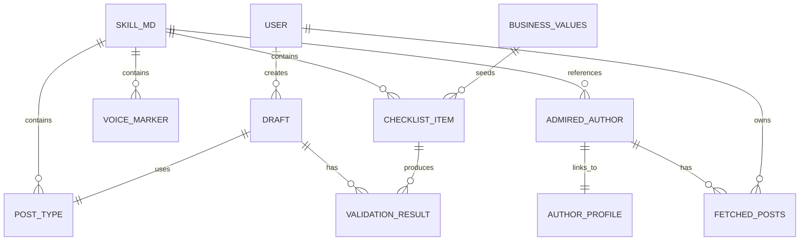

# LinkedIn Voice Development Skill

## Overview

A skill that compounds personal writing voice for LinkedIn through analysis, style guide development, and constitutional validation. Integrates with the compound-ai-leadership system to treat content creation as a knowledge-compounding activity.

**Core thesis:** Your LinkedIn voice should compound over time—learning from your patterns, admired authors, and post-publication feedback—rather than starting fresh with each post.

---

## Problem Statement

1. **AI slop epidemic**: Most AI-generated LinkedIn content is generic, inauthentic, and indistinguishable
2. **No persistent voice**: Each drafting session starts from scratch with no memory of what works
3. **Scattered influences**: Admiration for various thought leaders doesn't translate into actionable patterns
4. **No validation system**: No gut-check against core values before publishing
5. **No learning loop**: Published posts don't feed back into improving future drafts

---

## Proposed Solution

A skill that follows existing compound-ai-leadership patterns:

```
skills/linkedin-voice/
├── SKILL.md                    # Main skill file with style guide + constitutional checklist
├── posts/                      # Fetched/analyzed posts
│   ├── own/                    # User's posts
│   └── thought-leaders/        # Admired authors' posts
├── drafts/                     # Work-in-progress drafts
└── templates/                  # Reusable post type templates
```

**Integration points:**
- Loads `skills/business-values/SKILL.md` for constitutional checklist base
- Creates author profiles in `skills/author-profiles/profiles/` for thought leaders
- Uses `/ingest` workflow patterns for processing fetched posts
- Follows interactive, write-frequently patterns from `/compound-decision`

---

## Technical Approach

### Phase 1: Core Infrastructure

#### 1.1 Create Skill Directory Structure

```bash
mkdir -p skills/linkedin-voice/{posts/own,posts/thought-leaders,drafts,templates}
```

#### 1.2 Create RapidAPI Fetch Utility

**File:** `utils/fetch-linkedin-posts.sh`

Pattern from PowerConnect (`/Users/henryfinkelstein/Desktop/code/bc/powerconnect/services/linkedin/scraper.ts`):
- Load credentials from `.env` via `process.env.RAPIDAPI_KEY`
- Use `real-time-data-enrichment.p.rapidapi.com` host
- Paginate with `start` parameter (0, 50, 100...)
- Store raw responses for historical tracking
- Implement exponential backoff for rate limits

```bash
# Usage
./utils/fetch-linkedin-posts.sh "username" 50 "output.json"
```

**Endpoints:**
- `GET /get-profile-posts?username={username}&start={offset}` - Fetch posts
- `GET /get-profile-data-by-url?url={linkedin_url}` - Profile data (if needed)

**Rate limiting:** 10 requests/minute, 500/day (adjust based on plan)

#### 1.3 Create Post Inspector Integration

**Purpose:** Validate link preview images before sharing URLs in posts

**Tool URL pattern:**
```
https://www.linkedin.com/post-inspector/inspect/{encoded_url}
```

**Example:**
```
https://www.linkedin.com/post-inspector/inspect/https:%2F%2Freflect.thrivinghenry.com%2F
```

**OG tag requirements for link previews:**
- `og:image`: Minimum 1200 x 627 pixels (1.91:1 ratio)
- `og:title`: Max 150 characters
- `og:description`: Brief description
- `og:image:width` and `og:image:height`: Help LinkedIn scale properly

**Cache behavior:** LinkedIn caches for 7 days. Append `?v=2` to force refresh.

---

### Phase 2: SKILL.md Structure

**File:** `skills/linkedin-voice/SKILL.md`

```markdown
# LinkedIn Voice

Your personal style guide for LinkedIn posting. This skill compounds
over time through analysis, calibration, and post-publication feedback.

## Usage

Load this skill when:
- Drafting a LinkedIn post
- Analyzing an admired thought leader's style
- Reviewing and refining your voice patterns
- Validating a draft against your principles

---

## Style Guide

### Channel: LinkedIn

**Voice characteristics:**
- [To be developed through initial calibration]

**Tone:** [professional-casual spectrum position]

**Length sweet spots:**
- Hook: First 210 characters (before "...see more")
- Ideal post: 150-300 words
- Max: 3,000 characters

**Formatting patterns:**
- [Line break usage]
- [Emoji policy]
- [Bold/emphasis patterns]

**Anti-patterns to avoid:**
- [Developed through analysis and calibration]

### Voice Markers (What Makes It "You")

**Phrases you use:**
- [To be populated]

**Things you never say:**
- [To be populated]

**Distinctive patterns:**
- [To be populated]

---

## Post Type Library

### [Type Name]
**Purpose:** [When to use]
**Structure:** [Pattern]
**Hook style:** [How it opens]
**Example:** [Link to posts/]

[Types to be developed through analysis]

---

## Constitutional Checklist

Pre-publish validation against core principles. Modeled on business-values pattern.

### 1. Value-First
**Principle:** Every post should leave the reader better off.

**Validation questions:**
- [ ] Does this educate, inspire, or provide actionable insight?
- [ ] Would someone thank me for reading this?

**Anti-patterns:**
- Engagement bait without substance
- "Thoughts?" with no real position
- Humble-bragging without value delivery

### 2. Authentic Voice
**Principle:** Sound like you, not like LinkedIn AI slop.

**Validation questions:**
- [ ] Would I say this in a real conversation?
- [ ] Does this match my documented voice markers?

**Anti-patterns:**
- Generic advice without personal lens
- Corporate speak
- Manufactured enthusiasm

### 3. [Additional principles from business-values]
[Auto-populated from skills/business-values/SKILL.md]

---

## Link Preview Checklist

Before sharing any URL in a post:

- [ ] Run through LinkedIn Post Inspector
- [ ] Verify og:image is 1200x627px minimum
- [ ] Check that face/key content isn't cropped
- [ ] Confirm og:title is under 150 characters
- [ ] Test on mobile preview

**Post Inspector URL:**
`https://www.linkedin.com/post-inspector/inspect/{your-encoded-url}`

---

## Admired Authors

Links to author profiles analyzed for style patterns.

| Author | Profile | Key patterns adopted |
|--------|---------|---------------------|
| [Name] | `skills/author-profiles/profiles/[slug].yaml` | [What you took from them] |

---

## Evolution Notes

This skill compounds through:
1. Initial calibration (analyze your 50 posts + admired authors)
2. Author analysis sessions (extract patterns you admire)
3. Drafting feedback (track what gets revised, why)
4. Post-publication learning (what performed well)
5. Quarterly voice drift checks

Last calibration: [DATE]
Next review: [DATE]
```

---

### Phase 3: Workflows

#### 3.1 Initial Calibration Command

**File:** `commands/workflows/linkedin-calibrate.md`

```markdown
---
name: linkedin-calibrate
description: |
  Initialize your LinkedIn voice by analyzing your recent posts
  and extracting patterns from admired thought leaders.
---

# LinkedIn Voice Calibration

## Phase 0: Setup

1. Verify today's date (check system, don't guess)
2. Load `skills/linkedin-voice/SKILL.md`
3. Load `skills/business-values/SKILL.md` for constitutional base

## Phase 1: Fetch Your Posts

1. Ask: "What's your LinkedIn username?"
2. Fetch 50 recent posts via RapidAPI
3. Save to `skills/linkedin-voice/posts/own/[date]-fetch.json`
4. [Wait for confirmation]

## Phase 2: Analyze Your Patterns

For your posts, extract:
- Hook patterns (how you open)
- Structure patterns (how you organize)
- Length distribution
- Emoji/formatting usage
- Topic clusters

Present findings. Ask: "What resonates? What do you want to change?"
[Wait for response]

## Phase 3: Identify Admired Authors

Ask: "Name 2-5 LinkedIn creators whose style you admire."

For each:
1. Fetch their 50 recent posts
2. Save to `skills/linkedin-voice/posts/thought-leaders/[username].json`
3. Run author analysis workflow

[Wait after each author]

## Phase 4: Collaborative Style Extraction

For each admired author:
1. Present initial analysis
2. Ask: "What specifically resonates with you in [Author]'s style?"
3. Ask: "What do they do that you'd never do?"
4. Ask: "Which post made you stop scrolling—why?"
5. Extract patterns and anti-patterns
6. Propose additions to style guide

[Write to SKILL.md after each author]

## Phase 5: Build Constitutional Checklist

1. Load business values
2. For each value, create LinkedIn-specific validation question
3. Add any personal principles not in business values
4. Present checklist for approval

[Write to SKILL.md]

## Phase 6: Generate Post Type Library

Based on analysis:
1. Identify 5-7 post types you've used or want to use
2. Create template for each
3. Link examples from analyzed posts

[Write to SKILL.md]

## Phase 7: Finalize

1. Review complete SKILL.md
2. Set next calibration date (suggest: 3 months)
3. Suggest first post to draft using new voice
```

#### 3.2 Author Analysis Command

**File:** `commands/workflows/linkedin-analyze-author.md`

```markdown
---
name: linkedin-analyze-author
description: |
  Deep-dive into an admired LinkedIn creator's style.
  Extract patterns to fold into your own voice.
---

# Author Style Analysis

## Phase 0: Setup

1. Load `skills/linkedin-voice/SKILL.md`
2. Ask: "Who do you want to analyze?" (name or LinkedIn URL)
3. Check if posts already fetched

## Phase 1: Fetch Posts (if needed)

1. Fetch 50 recent posts
2. Save to `skills/linkedin-voice/posts/thought-leaders/[username].json`

## Phase 2: Pattern Analysis

Present:
- **Hook patterns:** How they open posts
- **Structure patterns:** How they organize content
- **Signature phrases:** Recurring language
- **Topic focus:** What they write about
- **Engagement patterns:** What gets most interaction

[Wait for response]

## Phase 3: Collaborative Discussion

Interactive Q&A (5-10 exchanges):
1. "What specifically resonates with you in their style?"
2. "What do they do that you'd never do?"
3. "Which of their posts made you stop scrolling—why?"
4. "What's one pattern you'd like to adopt?"
5. "How would you adapt it to your voice?"

[Write notes after each exchange]

## Phase 4: Extract Insights

Propose updates to style guide:
- New voice markers to add
- Anti-patterns to flag
- Post types to try
- Structural patterns to adopt

[Wait for approval]

## Phase 5: Update System

1. Update `skills/linkedin-voice/SKILL.md` with approved patterns
2. Create/update author profile in `skills/author-profiles/profiles/[slug].yaml`
3. Add to admired authors table

[Write to files]
```

#### 3.3 Drafting Command

**File:** `commands/workflows/linkedin-draft.md`

```markdown
---
name: linkedin-draft
description: |
  Draft a LinkedIn post with style guide adherence
  and constitutional validation.
---

# LinkedIn Post Drafting

## Phase 0: Load Context

1. Load `skills/linkedin-voice/SKILL.md`
2. Load `skills/business-values/SKILL.md`

## Phase 1: Intent Capture

1. Ask: "What do you want to post about?"
2. Ask: "What's your goal?" (educate, share milestone, spark discussion, etc.)
3. Capture gut feel: "How excited are you about this topic? (1-10)"

[Write to draft file]

## Phase 2: Post Type Selection

Present Post Type Library. Ask:
- "Which type fits your goal?"
- Options: [list from library] or "Surprise me"

If "Surprise me": Suggest based on rotation (what haven't you posted recently?)

[Write selection to draft]

## Phase 3: Generate Draft

Using:
- Selected post type template
- Style guide voice markers
- Topic and goal from Phase 1

Generate draft adhering to:
- Length guidelines (hook in first 210 chars)
- Voice characteristics
- Formatting patterns

Present draft.

[Write to `skills/linkedin-voice/drafts/[date]-[slug].md`]

## Phase 4: Constitutional Validation

Run each checklist item:

### Value-First
- [ ] Does this educate, inspire, or provide actionable insight?
- [ ] Would someone thank me for reading this?

### Authentic Voice
- [ ] Would I say this in a real conversation?
- [ ] Does this match documented voice markers?

### [Other principles...]

Present results with pass/fail for each.

[Write validation results to draft file]

## Phase 5: Handle Failures (if any)

For each failure:
1. Explain what failed and why
2. Ask: "Revise draft, accept exception, or adjust checklist?"

If revise: Return to Phase 3
If exception: Document reason
If adjust checklist: Collaborative discussion, update SKILL.md

[Write after each decision]

## Phase 6: Link Preview Check (if post contains URL)

If draft contains a URL:
1. Remind about Post Inspector
2. Provide inspector URL: `https://www.linkedin.com/post-inspector/inspect/{encoded_url}`
3. Checklist:
   - [ ] og:image is 1200x627px minimum
   - [ ] Face/key content not cropped
   - [ ] og:title under 150 characters

[Wait for confirmation]

## Phase 7: Finalize

1. Present final draft
2. Ask: "Ready to publish, or more revisions?"
3. If ready: Move draft to `published/` folder
4. Ask: "Want to log performance after publishing?"

## Phase 8: Post-Publication (Optional)

After user publishes:
1. Ask: "How did it perform?" (high/normal/low engagement)
2. If high: Analyze what worked, suggest emphasizing those patterns
3. Update style guide insights

[Write learnings to SKILL.md]
```

---

### Phase 4: Image & Formatting Specs

#### LinkedIn Dimensions Reference (from Figma Official Guide)

Add to SKILL.md or create `skills/linkedin-voice/specs.md`:

```markdown
## LinkedIn Technical Specifications

Source: [Figma LinkedIn Size Guide](https://www.figma.com/resource-library/linkedin-size-guide/)

### Post Character Limits
- **Total limit:** 3,000 characters
- **Desktop preview:** ~140 characters before "...see more"
- **Mobile preview:** ~110 characters before "...see more"
- **Critical hook zone:** First 210 characters

### In-Feed Post Image Dimensions

| Type | Dimensions | Aspect Ratio | Max Size | Format |
|------|------------|--------------|----------|--------|
| Square | 1080 x 1080 px | 1:1 | 8 MB | PNG, JPG |
| Portrait | 1920 x 1080 px | 9:16 | 8 MB | PNG, JPG |
| Landscape | 1200 x 626 px | 1.91:1 | 8 MB | PNG, JPG |

### Profile Images

| Type | Dimensions | Max Size | Format |
|------|------------|----------|--------|
| Personal profile photo | 400 x 400 px | 8 MB | PNG, JPG |
| Personal background/banner | 1584 x 396 px | 8 MB | PNG, JPG |
| Company logo | 400 x 400 px | 3 MB | PNG, JPG |
| Company cover photo | 1128 x 191 px | 3 MB | PNG, JPG |

### LinkedIn Life Tab (Company Pages)

| Type | Dimensions | Max Size |
|------|------------|----------|
| Main image | 1128 x 376 px | 3 MB |
| Custom modules | 502 x 282 px | 3 MB |
| Company photos | 900 x 600 px | 3 MB |

### Video Specifications
- **Resolution range:** 256 x 144 px (min) to 4096 x 2304 px (max)
- **Aspect ratio:** 1:2.4 to 2.4:1
- **File size:** 75 KB (min) to 5 MB (max)
- **Duration:** Up to 15 min (desktop) or 10 min (mobile)
- **Frame rates:** 10 fps to 60 fps
- **Bit rates:** 192 kbps to 30 Mbps

### LinkedIn Ad Sizes

| Ad Type | Dimensions | Max Size | Format |
|---------|------------|----------|--------|
| Single image (landscape) | 1200 x 628 px | 5 MB | PNG, JPG, GIF |
| Single image (square) | 1200 x 1200 px | 5 MB | PNG, JPG, GIF |
| Single image (vertical) | 720 x 900 px | 5 MB | PNG, JPG, GIF |
| Carousel ad | 1080 x 1080 px (1:1) | 10 MB | PNG, JPG, GIF |
| Sponsored InMail | 300 x 250 px | 2 MB | PNG, JPG |

### Link Preview (OG Tags)

Required meta tags for proper link previews:
```html
<meta property="og:title" content="Title (max 150 chars)" />
<meta property="og:description" content="Description" />
<meta property="og:image" content="https://site.com/image.jpg" />
<meta property="og:image:width" content="1200" />
<meta property="og:image:height" content="627" />
<meta property="og:url" content="https://site.com/page" />
```

**OG Image requirement:** Minimum 1200 x 627 px (1.91:1 ratio) for proper display.

**Cache:** LinkedIn caches previews for 7 days. Force refresh by appending query string (e.g., `?v=2`).

### Post Inspector

**URL:** `https://www.linkedin.com/post-inspector/`

**Note:** Requires LinkedIn login to use.

**What it does:**
1. Shows how your URL will appear when shared on LinkedIn
2. Identifies missing OG metadata on your page
3. Allows you to request a re-scrape if content has changed
4. Helps debug preview issues

**To inspect a URL:**
1. Go to https://www.linkedin.com/post-inspector/
2. Log in with your LinkedIn account
3. Enter the URL you want to inspect
4. Click "Inspect"

**Use to verify:**
- Image displays correctly (not cropped—check that faces aren't cut off!)
- Title and description render properly
- No broken preview
```

---

## Acceptance Criteria

### Functional Requirements

- [ ] Can fetch 50 posts from any public LinkedIn profile via RapidAPI
- [ ] Stores fetched posts in structured JSON for analysis
- [ ] SKILL.md contains complete style guide structure
- [ ] Constitutional checklist validates against business values
- [ ] Post Type Library has 5+ types with templates
- [ ] Drafting workflow produces styled, validated posts
- [ ] Link preview checklist integrated into drafting flow
- [ ] Post Inspector integration documented with URL pattern

### Non-Functional Requirements

- [ ] API credentials stored in `.env` (gitignored)
- [ ] Rate limiting respects RapidAPI plan limits
- [ ] Error handling for API failures with graceful degradation
- [ ] Interactive workflows write after every phase
- [ ] Follows existing skill patterns (business-values, author-profiles)

### Quality Gates

- [ ] SKILL.md matches structure of existing skills
- [ ] Commands follow `/compound-decision` interaction patterns
- [ ] Integration with business values is automatic, not manual
- [ ] Test with real LinkedIn profiles before considering complete

---

## Dependencies & Prerequisites

1. **RapidAPI account** with Real-Time Data Enrichment subscription
2. **`.env` file** with `RAPIDAPI_KEY` configured
3. **jq** installed for JSON processing in bash scripts
4. **Existing business values** in `skills/business-values/SKILL.md`

---

## File Manifest

### New Files to Create

| File | Purpose |
|------|---------|
| `skills/linkedin-voice/SKILL.md` | Main skill file |
| `skills/linkedin-voice/posts/own/.gitkeep` | User's fetched posts |
| `skills/linkedin-voice/posts/thought-leaders/.gitkeep` | Admired authors' posts |
| `skills/linkedin-voice/drafts/.gitkeep` | Work-in-progress |
| `skills/linkedin-voice/templates/.gitkeep` | Post type templates |
| `utils/fetch-linkedin-posts.sh` | RapidAPI fetch utility |
| `commands/workflows/linkedin-calibrate.md` | Initial setup workflow |
| `commands/workflows/linkedin-analyze-author.md` | Author analysis workflow |
| `commands/workflows/linkedin-draft.md` | Drafting workflow |

### Files to Update

| File | Change |
|------|--------|
| `CLAUDE.md` | Add linkedin-voice to core resources table |
| `.env.example` | Add `RAPIDAPI_KEY` template |

---

## References & Research

### Internal References
- PowerConnect RapidAPI integration: `/Users/henryfinkelstein/Desktop/code/bc/powerconnect/services/linkedin/scraper.ts`
- Business values pattern: `skills/business-values/SKILL.md`
- Author profiles pattern: `skills/author-profiles/SKILL.md`
- Tactical checklists pattern: `skills/tactical-checklists/SKILL.md`

### External References
- [Figma LinkedIn Size Guide](https://www.figma.com/resource-library/linkedin-size-guide/) - **Primary source** for all image dimensions (official, comprehensive)
- [LinkedIn Post Inspector](https://www.linkedin.com/post-inspector/) - Official debugging tool (requires login)
- [LinkedIn Post Inspector Guide](https://kinsta.com/blog/linkedin-debugger/) - How to fix link previews
- [SalesRobot Post Inspector Guide](https://www.salesrobot.co/blogs/linkedin-post-inspector) - OG tag requirements
- [Hootsuite Social Media Image Sizes](https://blog.hootsuite.com/social-media-image-sizes-guide/) - Cross-platform specs

### Research Sources (from planning)
- Constitutional AI patterns from Anthropic research
- Stylometric analysis frameworks
- Brand voice development methodologies
- LinkedIn algorithm research (viral post analysis)

---

## Open Questions Resolved

| Question | Resolution |
|----------|------------|
| Storage format? | Markdown for SKILL.md, JSON for fetched posts (matches existing patterns) |
| Constitutional validation? | LLM-based with business values as base, user can add LinkedIn-specific |
| Integration with author-profiles? | Yes, create profiles for thought leaders analyzed |
| Rate limiting? | Follow PowerConnect pattern: 10/min, 500/day with exponential backoff |
| Link preview validation? | Post Inspector integration with OG tag checklist |

---

## ERD: Data Relationships



---

## Implementation Notes

### Pattern Replication from PowerConnect

Key patterns to adopt from the existing LinkedIn scraper:

1. **Service class structure** with static config and instance methods
2. **Validation before fetch** (URL format, credentials present)
3. **Raw response storage** for historical tracking and re-analysis
4. **Structured logging** for debugging API issues
5. **Error details capture** with full context

### Simplicity Constraints

Per project principles:
- Start with bash script for fetching (no Node.js dependency needed)
- Single SKILL.md file until complexity demands splitting
- No database—file-based storage only
- No web UI—Claude Code CLI only
- No automation—user-triggered workflows only
